# Finteligence
**Finteligence** is a production-ready AI-powered fundamental analysis mentor. Built on a 9-layer architecture and Factor-Agents state machine, it transforms complex financial data into educational insights through a conversational interface.

Users can ask questions about any publicly listed company — income statements, cash flows, intrinsic value, earnings call transcripts — and receive structured, educational answers. Not investment advice.

---

## 🚀 Key Features

- [✅] **Autonomous Agent Orchestration** — Factor-Agents stateless reasoning loop with multi-step tool-calling
- [✅] **9-Layer Production Architecture** — Services, Agents, Prompts, Security, Evaluation, Observability, AI Memory, Data, Tests
- [✅] **Financial Data Tools** — Income statement, balance sheet, cash flow, EPS, earnings call transcripts, intrinsic value
- [✅] **Three-Gate Security** — Input guard → content filter → output filter protecting every request
- [✅] **Voice Input / Output** — Whisper STT + TTS audio responses
- [✅] **Semantic Cache** — Cosine-similarity cache to reduce redundant API calls
- [✅] **Observability** — Full request tracing, user feedback collection, cost tracking per model
- [✅] **Evaluation Layer** — Golden dataset + offline eval runner + online monitor
- [⚠️] **RAG Pipeline** — Semantic retrieval over financial documents (in progress)

---

## 🗺️ Data Flow Diagram

The diagram below shows how a user request travels through all 9 layers of the system, from raw input to final response.


<div align="center">
  
</div>

---

## 🏗️ 9-Layer Architecture

| # | Layer | Folder | Purpose |
|---|-------|--------|---------|
| 1 | **Services** | `app/services/` | Brain: query rewriting, routing, caching, conversation, pipeline orchestration |
| 2 | **Agents** | `app/agents/` | Workers: financial reasoning loop, query decomposer, adaptive router, tools |
| 3 | **Prompts** | `app/prompts/` | Template store + versioned registry — zero inline prompt strings |
| 4 | **Security** | `app/security/` | Three-gate safety: input guard → content filter → output filter |
| 5 | **Evaluation** | `evaluation/` | Golden dataset, offline eval (pre-deploy), online monitor (post-deploy) |
| 6 | **Observability** | `observability/` | Tracer, feedback collector, cost tracker |
| 7 | **AI Memory** | `.antigravity/` | Code-style + testing rules for AI coding assistants |
| 8 | **Data** | `data/` | Raw files, processed data, chunking/embedding config |
| 9 | **Tests** | `tests/` | 24 automated tests covering routing, security, tools, agents, prompts |

---

## 🛠️ Tech Stack

| Component | Technology |
|-----------|-----------|
| Language | Python 3.10+ |
| LLM | OpenAI GPT-5.1 (chat), Whisper (STT), GPT-4o-mini-TTS (TTS) |
| Financial Data | Alpha Vantage API |
| UI | Streamlit |
| Agent Pattern | Factor-Agents (stateless reducer) |
| Data Processing | Pandas, NumPy |
| Validation | Pydantic v2 |
| Testing | pytest |

---

## 🔧 Getting Started

### Prerequisites
- Python 3.10+
- OpenAI API Key
- Alpha Vantage API Key

### Installation

**1. Clone the repository:**
```bash
git clone https://github.com/yourusername/finteligence.git
cd finteligence
```

**2. Create virtual environment and install dependencies:**
```bash
python3 -m venv .venv
source .venv/bin/activate       # macOS / Linux
# .venv\Scripts\activate        # Windows
pip install -r requirements.txt
```

**3. Configure API keys:**
```bash
cp config.yml.example config.yml
# Edit config.yml and add your OPENAI_API_KEY and ALPHAVANTAGE_API_KEY
```

Or use a `.env` file:
```
OPENAI_API_KEY=sk-...
ALPHAVANTAGE_API_KEY=...
```

**4. Run the app:**
```bash
streamlit run frontend/App.py
```

**5. Run tests:**
```bash
pytest tests/ -v
```

**6. Run offline evaluation:**
```bash
python -m evaluation.offline_eval
```

---

## 📁 Project Structure

```
Finteligence/
├── app/                    ← Application core
│   ├── main.py             ← Single entry-point (wires all layers)
│   ├── config.py           ← Centralised config & env vars
│   ├── models.py           ← Shared Pydantic models
│   ├── services/           ← Layer 1: Brain
│   ├── agents/             ← Layer 2: Workers
│   ├── prompts/            ← Layer 3: Prompt management
│   └── security/           ← Layer 4: Safety gate
├── agent/                  ← Factor-Agents state machine
│   ├── tooling.py          ← Backwards-compatibility shim
│   └── utils.py            ← Alpha Vantage financial utilities
├── evaluation/             ← Layer 5: Quality testing
├── observability/          ← Layer 6: Visibility
├── .antigravity/           ← Layer 7: AI assistant memory
├── data/                   ← Layer 8: Knowledge preparation
├── tests/                  ← Layer 9: Automated tests (24 tests)
└── frontend/               ← Streamlit frontend code
    ├── App.py              ← Streamlit UI (presentation only)
    └── .streamlit/         ← Streamlit configuration
```

---

> ⚖️ **Disclaimer** — This application is for **educational and informational purposes only**.
> It is not financial advice or an investment recommendation. Always consult a qualified financial advisor.